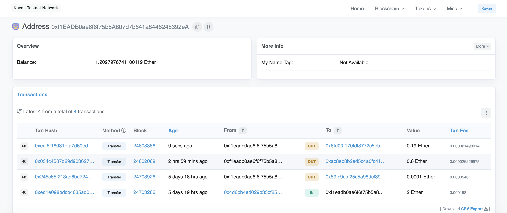
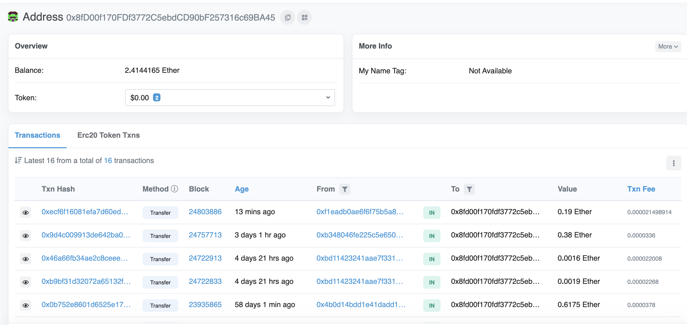
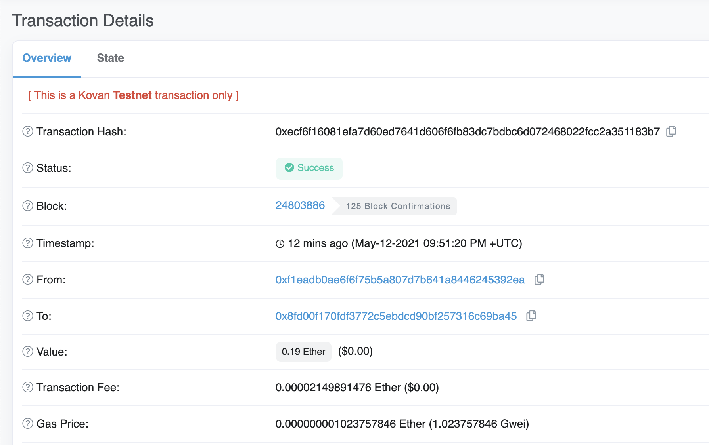

# Fintech Finder - Blockchain Wallet

You work at a startup that is building a new and disruptive platform called Fintech Finder. Fintech Finder is an application that its customers can use to find fintech professionals from among a list of candidates, hire them, and pay them. As Fintech Finder’s lead developer, you have been tasked with integrating the Ethereum blockchain network into the application in order to enable your customers to instantly pay the fintech professionals whom they hire with cryptocurrency. In this Challenge, you will complete the code that enables your customers to send cryptocurrency payments to fintech professionals. To develop the code and test it out, you will assume the perspective of a Fintech Finder customer who is using the application to find a fintech professional and pay them for their work.

---

## Technologies

This project leverages python 3.7 with the following packages:

* [Streamlit](https://streamlit.io/) - Python library for building web interfaces for your Python applications.

* [Web3.py](https://web3py.readthedocs.io/en/stable/overview.html) - A Python library for connecting to and performing operations on Ethereum-based blockchains.

* [ethereum-tester](https://pypi.org/project/ethereum-tester/0.1.0a4/) - A Python library that provides access to the tools we’ll use to test Ethereum-based applications.

* [mnemonic](https://pypi.org/project/mnemonic/) - A Python implementation for generating a 12- or 24-word mnemonic seed phrase based on the BIP-39 standard.

* [bip44](https://pypi.org/project/bip44/) - A Python implementation for deriving hierarchical deterministic wallets from a seed phrase based on the BIP-44 standard.

* [Infura API] https://infura.io/dashboard/ethereum) - An API that provides instant access to the Ethereum network over HTTPS (i.e., the web). You will need to create an account with Infura.

---

## Installation Guide

    
To install Streamlit, check that your dev environment is active, and then run the following:

    pip install streamlit

To install the Web3.py library, check that your dev environment is active, and then run the following:

    pip install web3==5.17

To install the ethereum-tester library, check that your dev environment is active, and then run the following:

    pip install eth-tester

To install the mnemonic package, check that your dev environment is active, and then run the following:

    pip install mnemonic

To install the bip44 package, check that your dev environment is active, and then run the following:

    pip install bip44
---

## Usage

You will assume the perspective of a Fintech Finder customer in order to do the following:

- Generate a new Ethereum account instance by using your mnemonic seed phrase.

- Fetch and display the account balance associated with your Ethereum account address.

- Calculate the total value of an Ethereum transaction, including the gas estimate, that pays a Fintech Finder candidate for their work.

- Digitally sign a transaction that pays a Fintech Finder candidate, and send this transaction to the Kovan testnet.

- Review the transaction hash code associated with the validated blockchain transaction.

Once you receive the transaction’s hash code, you will navigate to Kovan’s Etherscan website to review the blockchain transaction details. 

To confirm that you have successfully created the transaction, you should have outcomes similar to the ones shown below. 

## Outcome 

Streamlit: 

Address Balance: 

Receiver Transaction History:

Transaction Details: 

---

## Contributors

Brought to you by Edgar Coronado

---

## License

MIT